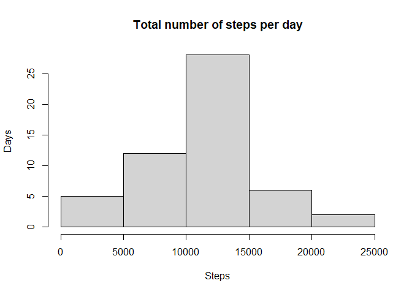
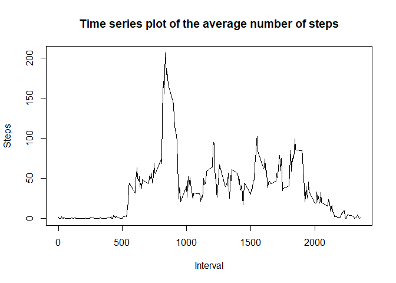
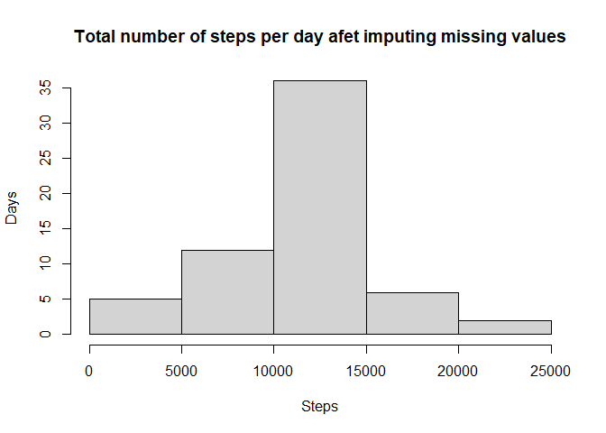
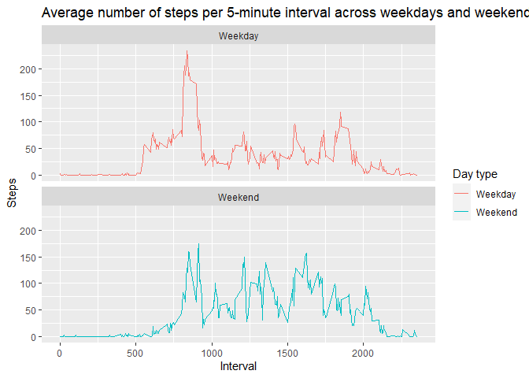

### Loading packages

```r
library(ggplot2)
library(dplyr)
```

```
## 
## Attaching package: 'dplyr'
```

```
## The following objects are masked from 'package:stats':
## 
##     filter, lag
```

```
## The following objects are masked from 'package:base':
## 
##     intersect, setdiff, setequal, union
```

## Loading and preprocessing the data

```r
path = getwd()
unzip("activity.zip", exdir = path)
activity <- read.csv("activity.csv")
head(activity)
```

```
##   steps       date interval
## 1    NA 2012-10-01        0
## 2    NA 2012-10-01        5
## 3    NA 2012-10-01       10
## 4    NA 2012-10-01       15
## 5    NA 2012-10-01       20
## 6    NA 2012-10-01       25
```

## What is mean total number of steps taken per day?
### Histogram of the total number of steps taken each day

```r
total_steps_day <- aggregate(steps~date, activity, sum)
hist(total_steps_day$steps, xlab = "Steps", ylab = "Days", main = "Total number of steps per day")
```

<!-- -->

### Mean and median number of steps taken each day

```r
mean(total_steps_day$steps)
```

```
## [1] 10766.19
```

```r
median(total_steps_day$steps)
```

```
## [1] 10765
```

## What is the average daily activity pattern?
### Time series plot of the average number of steps taken

```r
average_daily_activity <- aggregate(steps~interval, activity, mean)
with(average_daily_activity, plot(interval, steps, xlab = "Interval", ylab = "Steps", main = "Time series plot of the average number of steps", type = "l"))
```

<!-- -->

### The 5-minute interval that, on average, contains the maximum number of steps

```r
average_daily_activity[which.max(average_daily_activity[, 2]), 1]
```

```
## [1] 835
```

## Imputing missing values
### Code to describe and show a strategy for imputing missing data
Calculate the missing values

```r
sum(is.na(activity$steps))
```

```
## [1] 2304
```
Finding the mean values of number of steps per interval

```r
mean_per_interval <- mean(average_daily_activity$steps)
mean_per_interval
```

```
## [1] 37.3826
```
Replacing missing values with mean value of number of steps per interval.

```r
activity_new <- activity
activity_new[is.na(activity_new)] <- mean_per_interval
head(activity_new)
```

```
##     steps       date interval
## 1 37.3826 2012-10-01        0
## 2 37.3826 2012-10-01        5
## 3 37.3826 2012-10-01       10
## 4 37.3826 2012-10-01       15
## 5 37.3826 2012-10-01       20
## 6 37.3826 2012-10-01       25
```
### Histogram of the total number of steps taken each day after missing values are imputed

```r
total_steps_day_new <- aggregate(steps~date, activity_new, sum)
hist(total_steps_day_new$steps, xlab = "Steps", ylab = "Days", main = "Total number of steps per day afet imputing missing values")
```

<!-- -->

## Are there differences in activity patterns between weekdays and weekends?
### Panel plot comparing the average number of steps taken per 5-minute interval across weekdays and weekends


```r
activity$date <- as.Date(strptime(activity$date, format = "%Y-%m-%d")) 
activity$day_type <- sapply(activity$date, function(x){
                        if(weekdays(x) == "Saturday"| weekdays(x) == "Sunday")
                          {y <- "Weekend"}
                        else {y <- "Weekday"}
                          y
                          }) 
activity_weekday <- aggregate(steps ~ interval + day_type, activity, mean, na.rm = TRUE)
```


```r
ggplot(activity_weekday, aes(x = interval, y = steps, color = day_type))+
    geom_line() + 
    ggtitle("Average number of steps per 5-minute interval across weekdays and weekends") +
    xlab("Interval") +
    ylab("Steps") +
    facet_wrap(~day_type, ncol = 1, nrow = 2) +
    labs(colour = "Day type")
```

<!-- -->
